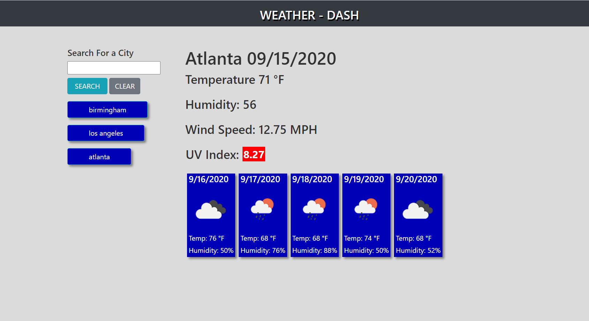

# WEATHER DASHBOARD FORECASTER

## ASSIGNMENT

This assignment was to create a weather app using the Open Weather Map API. The weather app was to be able to be searched by users & display styled information based on search inputs. The weather application was also to save previous searches by a user that would be clickable if a user was interested in looking at that search again. I accomplished this assignment by creating a primarily dynamically generated page that relied on two on click events to generate the a vast majority on the screen & two API calls to the Open Weath Map API. 

APIs are powerful tools that allow us to navigate between multiple software types & provide developers a way to bridge between disparate source of information and actions we can take the manipulate that information through API specific documentation. 

## DEVELOPMENT

For this project, as with all of my other projects I have a process document I created that I work through by looking at acceptance the minimum viable product, and writing out what sticks out to me about the particular project. This document always gives me a more efficient way to think about the scope of the project and the steps I need to take to accomplish the tasks ahead of me. For this project, I chose to dynamically generate almost all of the content through two click events & chained API calls. 

## APPLICATION PROGRAMMING INTERFACE

No one mandates good documentation for an API which can make things difficult. Luckily, the folks at Open Weather Map are professionals and not only was it easy to search their API through their website, but it was also easy to traverse their DOM to find the information necessary. So, in this case the primary API I used was the ONE CALL API, but that wasn't accesible through a city name value, so a user's search had to be first chained through an API call on Current Weather and the data that API provided would then unlock the higher level API call that generated a majority of the data for each search or saved search.

## LOCAL STORAGE

What can I say about local storage that hasn't already been said? Local Storage was a slight sticking point for me on this project as initially I tried creating an array of objects with the same key, which had me encounter a refreshing issue that would delete all previous entries. I going the direct of creating a storage object that had matching keys & values that made it easier to set & get items from local storage.

## CONSIDERATIONS

The primary struggle I had with this project revolved around scoping & setting a function inside of my initial click event that re-generated my past search text boxes, but that would upon reset, disable them from having the search/display functionality that they would have upon page load prior to searching. I addressed this by nesting my on click event that I only had once outside of the search on click event at the END of that event which resolved the problem. 

## MANY THANKS

Many thanks to my instructor, the TA's, my grandma & my fellow cohort for always asking questions and helping me develop a fuller understanding by sharing their code & their struggles along the way. Also thank you to the grading team for what you all do in looking over thousands of line of code in various states of functionality & providing positive feedback.

